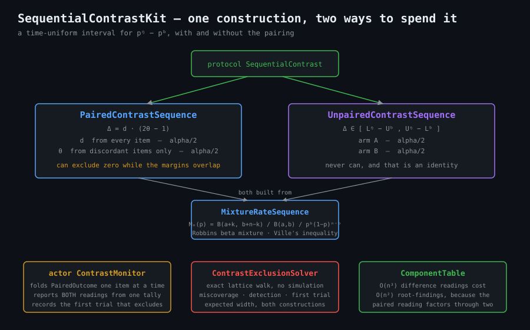
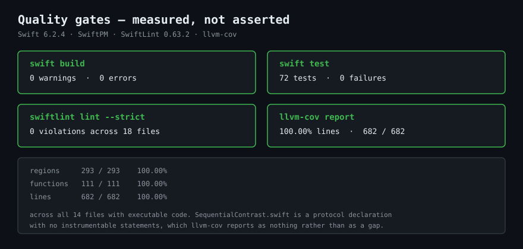
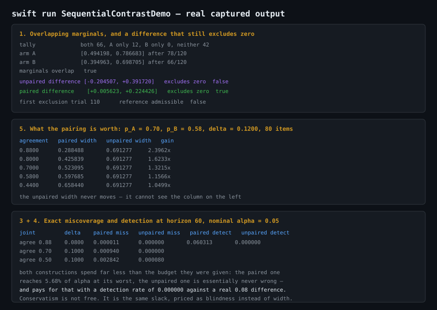

# SequentialContrastKit



`ConfidenceSequenceKit` answers "what is this rate?" with an interval you can look at after
every eval run without the guarantee expiring. Almost nothing anyone actually wants to know is
about one rate. The real question is a comparison: is prompt v2 better than v1, did the new
model regress against the old one, is the gate worth keeping on. That is a *difference* of two
rates, and it has a property a single rate does not.

You can build a perfectly good time-uniform interval for each system and still be unable to
answer the question. Here is a run where exactly that happens:

```
arm A                 [0.494198, 0.786683] after 78/120
arm B                 [0.394963, 0.698705] after 66/120
marginals overlap     true
unpaired difference   [-0.204507, +0.391720]    excludes zero  false
paired difference     [+0.005623, +0.224426]    excludes zero  true
```

Same 120 items, same alpha, same construction underneath. The two marginal intervals overlap
heavily, and reading that overlap as "no difference yet" is wrong. On the items the two systems
disagreed about, A won twelve out of twelve. That is strong evidence, and it is invisible the
moment you summarise each system to its own success count.

```swift
let monitor = try ContrastMonitor(alpha: 0.05, referenceDifference: 0)

// once per eval item, scored by both systems
let interval = try await monitor.observe(PairedOutcome(systemA: aPassed, systemB: bPassed))
if let trial = await monitor.firstExclusionTrial {
    // "these two are the same" is no longer admissible, and stopping here is legitimate:
    // no correction is owed for every look that came before it
    reportDifference(at: trial, interval: interval)
}
```

## Two constructions, and why both ship

**`UnpairedContrastSequence`** is the honest construction when the two arms really are separate
samples: different eval sets, different traffic, an online arm against an offline one. One
`MixtureRateSequence` per arm at `alpha / 2`, and the difference is the Minkowski difference of
the two readings.

```
p_A - p_B  in  [ lowerA - upperB , upperA - lowerB ]
```

It is also what a paired comparison degrades into when nobody recorded which item was which,
which is the more common situation. Note what that costs: because the bounds are a Minkowski
difference, this construction *cannot* exclude zero while the two arm intervals overlap. Not
"usually will not" — cannot. It is an identity, and it is the ceiling the other construction is
built to get above.

**`PairedContrastSequence`** uses the pairing. The decomposition is the old McNemar observation
run forwards into an interval instead of a test. Write `d` for the probability the two systems
disagree on an item, and `theta` for the probability A is the one that wins when they do:

```
p_A - p_B  =  p10 - p01  =  d * theta - d * (1 - theta)  =  d * (2 * theta - 1)
```

The items both systems got, and the items both missed, contribute nothing to that expression.
They are not noise to be averaged away; they carry no information about the difference at all,
and a construction that spends interval width on them is paying for evidence it never received.

So the package runs two component sequences — one for `d` advancing on every item, one for
`theta` advancing only on discordant items — each at `alpha / 2`, and combines them by interval
arithmetic on the product. On the event that both components cover, which has probability at
least `1 - alpha` by a union bound, the product contains the true difference at every look at
once.

Both of them are the *same* construction, `MixtureRateSequence`, read over two different count
streams. That is worth saying plainly because it is also why the exact solver needs one table
and not two.

### The one step in the argument worth stating rather than assuming

The win component is read at a data-dependent index: it advances only when the systems happen
to disagree, so after 120 items it may have seen 12 trials or 80. That is sound, and it is not
sound by accident. A non-negative martingale sampled along an increasing sequence of indices is
still a non-negative martingale, so Ville's bound on "ever crosses the threshold" already
quantifies over the discordant subsequence. No extra correction is owed, and none is applied.

### And one design question resolved by proof rather than a guard clause

`d` is non-negative and `2 * theta - 1` straddles zero, so the extremes of the product do not sit
at fixed corners — they move with the sign of the win bounds. `combine` takes the min and max
over all four corners, which is correct in every case and needs no sign analysis to read. There
is also no empty-interval case to handle: each component reading is found by bisecting between a
strictly excluded end and a strictly admissible one, so neither collapses to a point and the
product always has positive width.

## The slack is real, and so is what it costs

A union bound over two Ville inequalities says miscoverage is at most `alpha`. It does not say
how much of `alpha` is actually spent, and whatever goes unspent has been paid for somewhere
else. `ContrastExclusionSolver` measures both by walking the entire reachable state space rather
than sampling from it.

Measured this run, `alpha = 0.05`, uniform `Beta(1, 1)` prior, horizon 60:

| joint      | true delta | paired miscoverage | unpaired miscoverage | paired budget spent |
|------------|------------|--------------------|----------------------|---------------------|
| agree 0.88 | 0.0800     | 0.000011           | 0.000000             | 0.02%               |
| agree 0.70 | 0.1000     | 0.000940           | 0.000000             | 1.88%               |
| agree 0.50 | 0.1000     | 0.002842           | 0.000080             | 5.68%               |

Both are far inside their promise. The unpaired construction is essentially never wrong, and
that reads like the better column until you ask what it bought:

| joint      | true delta | paired detection | first trial | unpaired detection | first trial |
|------------|------------|------------------|-------------|--------------------|-------------|
| agree 0.88 | 0.0800     | 0.060313         | 49.7380     | 0.000000           | 21.9963     |
| agree 0.76 | 0.0800     | 0.047862         | 42.5616     | 0.000002           | 33.5883     |
| agree 0.60 | 0.0800     | 0.032534         | 35.7858     | 0.000131           | 35.1195     |

Against a real difference of 0.08 over 60 items, the unpaired construction detects it
essentially never. Its conservatism is not a free safety margin; it is the same unspent slack,
priced as blindness instead of as width. Read the "first trial" column on that side with care —
it is conditional on excluding at all, and it is being computed from a probability mass in the
seventh decimal place, so it describes a handful of freak paths and not typical behaviour.

Both constructions are weak at 60 items against a difference this small. That is the honest
reading, and neither column should be quoted as though 60 items were enough.

## What the pairing is actually worth

Hold both marginals fixed at `p_A = 0.70` and `p_B = 0.58`, so the true difference is 0.1200 in
every row, and sweep only how often the two systems happen to agree. Expected interval width at
80 items, exact:

| agreement | paired width | unpaired width | gain    |
|-----------|--------------|----------------|---------|
| 0.8800    | 0.288488     | 0.691277       | 2.3962x |
| 0.8000    | 0.425839     | 0.691277       | 1.6233x |
| 0.7000    | 0.523095     | 0.691277       | 1.3215x |
| 0.5800    | 0.597685     | 0.691277       | 1.1566x |
| 0.4400    | 0.658440     | 0.691277       | 1.0499x |

The unpaired column never moves. It cannot: the marginals are fixed, and the marginals are all
it can see. Everything the left column gains it gains from a quantity the other construction
does not have access to.

This matters because high agreement is the normal case in LLM evaluation. Two prompt variants,
or two checkpoints of the same model, agree on most items — that is what makes the comparison
hard, and it is exactly the regime where pairing pays most. At independent arms with the same
marginals the gain is a much flatter `1.1133x`, which is the fair reading: pairing is not a free
multiplier, it is worth what the correlation is worth.

## Cost

A paired reading after `n` items depends on `(n, n10, n01)`, so a lattice walk over a horizon is
`O(n^3)` difference intervals. Underneath, each one is two component readings indexed by
`(n, n10 + n01)` and `(n10 + n01, n10)`, so only `O(n^2)` root-findings actually happen and the
rest are table lookups. That factorisation is the difference between a solver that finishes and
one that does not, and it is why `ContrastExclusionSolver` builds `ComponentTable` rather than
calling the construction per lattice point.

The live path is cheap by comparison: `ContrastMonitor.observe(_:)` does one folded count plus
one interval, which is four bisections.

The demo runs the full set of exact audits and takes roughly 80 seconds in a debug build, almost
all of it in root-finding. Build it in release if you are iterating on it.

## Installation

```swift
.package(url: "https://github.com/rajatslakhina/sequential-contrast-kit.git", from: "1.0.0")
```

```swift
.target(name: "YourTarget", dependencies: [
    .product(name: "SequentialContrastKit", package: "sequential-contrast-kit")
])
```

Swift 6, SwiftPM, no dependencies. macOS 13+, iOS 16+, tvOS 16+, watchOS 9+.

## Usage

Fold items in as they are scored, and read whichever construction the data supports:

```swift
let monitor = try ContrastMonitor(alpha: 0.05, referenceDifference: 0)
try await monitor.observe(contentsOf: results.map {
    PairedOutcome(systemA: $0.variantAPassed, systemB: $0.variantBPassed)
})

let paired = try await monitor.pairedInterval()
let unpaired = try await monitor.unpairedInterval()
print(paired.excludesZero, try await monitor.pairingGain())
```

Or ask the exact solver what a design is capable of before running it:

```swift
let solver = try ContrastExclusionSolver(alpha: 0.05)
let joint = try PairedJointDistribution(
    bothSucceed: 0.60, onlyASucceeds: 0.10, onlyBSucceeds: 0.02
)

// how often would this even notice, over 60 items?
let power = try solver.pairedProfile(referenceDifference: 0, joint: joint, horizon: 60)

// and what is recording the pairing worth here?
let comparison = try solver.widthComparison(trials: 80, joint: joint)
```

Arms of different sizes are supported on the unpaired construction, where they make sense:

```swift
try unpaired.interval(successesA: 30, trialsA: 40, successesB: 40, trialsB: 100)
```

## Quality gates



| gate | result |
|------|--------|
| `swift build` | 0 warnings, 0 errors |
| `swift test` | 72 tests, 0 failures |
| `llvm-cov report` | **100.00%** regions 293/293, functions 111/111, lines 682/682 |
| `swiftlint lint --strict` | 0 violations across 18 files (0.63.2, real binary) |

Coverage is 100.00% on every file in the library target that contains executable code.
`SequentialContrast.swift` is a protocol declaration with no instrumentable statements, which
`llvm-cov` reports as nothing rather than as a gap.

Two branches that a defensive instinct would have written are deliberately absent, because a
branch no test can take is a coverage hole wearing generality as a disguise:
`LogBeta.logGamma` ships no reflection branch for arguments below 0.5, since every argument it
can receive is a validated-positive prior parameter plus a non-negative count; and
`ContrastMonitor.pairingGain()` has no divide-by-zero guard, for the reason given above.
`LogBeta.logPower` does carry a branch, for the opposite reason: a joint distribution with a
cell of exactly zero is an ordinary input, `0^0` is 1 while `0 * log(0)` is `NaN`, and that
branch is the difference between a weight of one and a table full of `NaN`.



## Where this sits

| package | question |
|---------|----------|
| `SequentialBoundKit` | is the rate the bad one or the good one? (both named up front) |
| `ConfidenceSequenceKit` | what is the rate? (one system, no hypothesis pair) |
| **`SequentialContrastKit`** | **is A better than B, and by how much?** |

## License

MIT
